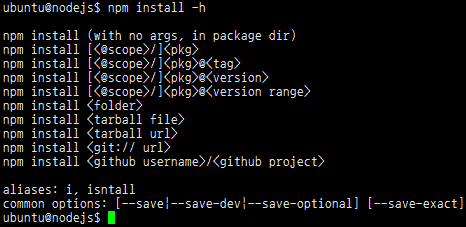
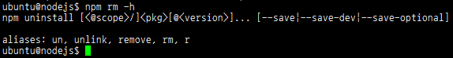
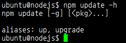

:octocat: [owo-study/nodejs2016](https://github.com/owo-study/nodejs2016)
# 부평 Node.js 스터디 (2016)

## NPM (Node Package Manager)
- 패키징된 사용자 모듈의 설치/업데이트/삭제와 의존성 관리를 자동으로 해주는 프로그램
  - linux의 yum이나 apt-get 혹은 윈도우의 프로그램 추가/삭제와 유사한 개념
  - (혹은 java의 maven / php의 composer / ruby의 gem / ios의 cocoapods 등과도..)


### 설치 (npm instll)

```shell
npm install [패키지명]
npm i [패키지명]
```

> ##### 전역 설치 옵션 -g
```shell
npm install -g [패키지명]
npm install [패키지명] -g
```

### 삭제 (npm remove)

```shell
npm remove [패키지명]
npm rm [패키지명]
```

### 업데이트 (npm update)

```shell
npm update [패키지명]
npm up [패키지명]
```

#### 추천 확장 모듈
- [express AND express-generator](http://expressjs.com/ko/) : express 웹서버 모듈과 프로젯트 생성 유틸리티
```shell
npm install express
[sudo] npm install express-generator -g
```
- [nodemon](https://github.com/remy/nodemon) : 소스의 변경이 있을때 프로그램을 자동으로 재시작 해주는 유틸리티
```shell
[sudo] npm install -g nodemon
```
- [forever](https://github.com/foreverjs/forever) : 작고 가벼운 Deamon 프로세스 관리 프로그램
```shell
[sudo] npm install forever -g
```
- [PM2](https://github.com/Unitech/pm2) : 다양한 기능과 모니터링을 갖춘 Deamon 프로세스 관리 프로그램
```shell
[sudo] npm install pm2 -g
```
- [mysql](https://github.com/mysqljs/mysql) : mysql 데이터베이스 접속 모듈
```shell
npm install mysql
```
- [socket.io server](http://socket.io/) : 소켓 프로그래밍을 위한 모듈
```shell
npm install socket.io
```


### package.json 파일을 이용한 관리
- package.json 파일의 구조

> 추천링크
> - [공식 홈페이지 가이드](https://docs.npmjs.com/files/package.json)
> - [package.json으로 npm 의존성 모듈 관리하기](https://blog.outsider.ne.kr/665)
