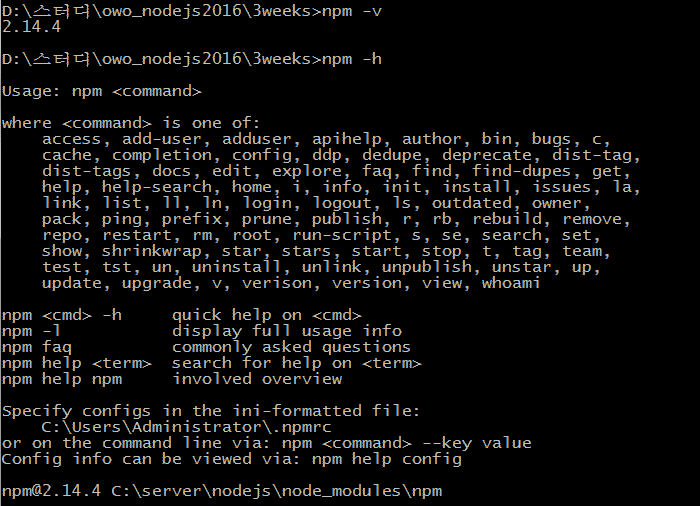

:octocat: [ owo-study/nodejs2016 ]
# 부평 Node.js 스터디 (2016)

## NPM (Node Package Manager)
- 패키징된 사용자 모듈의 설치/업데이트/삭제와 의존성 관리를 자동으로 해주는 프로그램
  - linux의 yum이나 apt-get 혹은 윈도우의 프로그램 추가/삭제와 유사한 개념
  - (혹은 java의 maven / php의 composer / ruby의 gem / ios의 cocoapods 등과도..)



### 설치 / 업데이트 / 삭제
```shell
npm instll [패키지명]
npm update [패키지명]
npm remobe [패키지명]
```

### 전역 설치 옵션 -g

### package.json 파일을 이용한 관리
- package.json 파일의 구조
